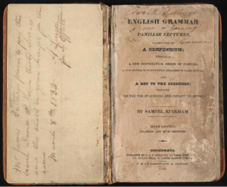
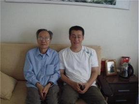

# 第六章 语法

## 1. 没文化的人才讨厌语法

没文化的人才讨厌语法 —— 这话好像说得重了一点，但却只不过是事实。经常有人以各种各样的理由宣扬 “不学语法也可以”，并且常常能因此获得追捧，但这只不过是疯子骗傻子而已，本质上来看一群没文化的人在集体意淫。去市场买菜，确实不需要懂语法，因为说的全都是短句、断句：

> 甲：多少钱一斤？ 
> 乙：两块二。 
> 甲：贵。 
> 乙：不贵！买多了给你抹点…… 
> 甲：行，来两斤。 
> 乙：两斤三两，行么？ 
> 甲：行。 
> 乙：零头抹了，算五块钱…… 
> 甲：嗯，谢谢。 
> 乙：好嘞！ 

可这只是我们学习语言文字的目的不仅仅是为了在这种场合说说话而已吧？稍微复杂一点的思考结果就面临一定的表达难度 —— 连语法都不过关，又如何清楚表达？而那些有思想的人用语言表达他们的思想之时，阅读者语法不过关，理解上就必然南辕北辙。

商务印书馆是个相当不错的出版社，然而也经常令人难过。比如，米尔顿•弗里德曼的（Milton Friedman）的《货币的祸害：货币史片段》一书中有一句译文是这样的：

> 货币是不能拿来开玩笑的，所以要交给中央银行。

熟悉弗里德曼的观点的人会吓一跳，“啊？老爷子什么时候改变看法了？！”

可原文是这样的（这是 Friedman 引用 Georges Clemenceau 的话）：

– image extracted from [Google Books search results](http://is.gd/6hMzX)

仅仅是因为 “too…to” 的结构前面多了一个 “much” 译者就给翻译错了，语法功底太差。而事实上，译者翻译完了一本书（为了翻译，必须 “研读” —— 比 “精读”、“通读”、“泛读” 都要仔细），可是竟然完全没看懂书的内容。所以，根本就没看出这句话和整本书的内容之间的矛盾 …… 这不是没文化是什么？

原本这世界应该有所分工，据说，社会大分工带来了前所未有的生产力提升。要是让那些有天分学习外语的人学好外语专职做好翻译，那么另外一些没有学习外语天分、却有其他天分的人就可以做一些他们擅长干的事情 —— 然后大家相互使用货币进行交换活动，社会效益会大幅度增加。可惜啊可惜。很多的时候，我们即便没有天分，也要咬着牙学好外语，要么实在是太吃亏了。

如果有机会接触各个文化的人就都知道了：其实，地球上任何一个文化的人群都一样，大部分的人讨厌甚至憎恨语法学习。许多年前，英国人在他们的语文课上要花费大量的时间精力教学生所谓 “Parsing” 的语法分析方法，可是现在却因所谓 “现代教育改革”（其实只不过是和过往任何一次该领域中的改革一样 “过大于功” 的另外一次 “改变” 而已）而被弃用：

> **Parsing**: Lost art of identifying all the components of a text, and once one of the fundamental exercises that tested and informed pupils in English. To parse a phrase such as ‘man bites dog’ involves noting that the singular noun ‘man’ is the subject of the sentence, the verb ‘bites’ is the third person singular of the present tense of the verb to bite, and the singular noun ‘dog’ is the object of the sentence.

> – Dictionary of Modern English Grammar, by Ned Halley, Wordsworth, 2005

这种基础语言训练是否像那些 “新锐改革派” 们所认为的那样一无是处乃至于必须废弃呢？才不是呢。事实上，这些所谓的改革者尽管愚蠢但在历史进程中却属于 “成功者”，因为他们 “竟然” 用不合理战胜了合理。其实也没啥可奇怪的，傻蛋总是可以 “成功” 地把世界变坏，这种例子随处可见，因为傻蛋最容易找到（众多）同伴，也因此在投票活动中最可能成为大多数 …… 他们最常挂在嘴边上的话是套用这个句型的：“……要不然怎么大家都……？” —— 尽管使用这个句型的句子有时候也确实有道理。

## 2. 无论如何都要学语法

于 1953 年获得诺贝尔文学奖的英国首相[Winston Churchill](http://www.winstonchurchill.org/)曾如此描述他儿时的这种语言训练对他来讲究竟有多么重要：

> By being so long in the lowest form I gained an immense advantage over the cleverer boys. They all went on to learn Latin and Greek and splendid things like that. But I was taught English. We were considered such dunces that we could learn only English. Mr. Somervell — a most delightful man, to whom my debt is great — was charged with the duty of teaching the stupidest boys the most disregarded thing–namely, to write mere English. He knew how to do it. He taught it as no one else has ever taught it. Not only did we learn English parsing thoroughly, but we also practised continually English analysis. Mr. Somervell had a system of his own. He took a fairly long sentence and broke it up into its components by means of black, red, blue, and green inks. Subject, verb, object: Relative Clauses, Conditional Clauses, Conjunctive and Disjunctive Clauses! Each had its colour and its bracket. It was a kind of drill. We did it almost daily. As I remained in the Third Form three times as long as anyone else, I had three times as much of it. I learned it thoroughly. Thus I got into my bones the essential structure of the ordinary British sentence — which is a noble thing. And when in after years my schoolfellows who had won prizes and distinction for writing such beautiful Latin poetry and pithy Greek epigrams had to come down again to common English, to earn their living or make their way, I did not feel myself at any disadvantage. Naturally I am biased in favor of boys learning English. I would make them all learn English: and then I would let the clever ones learn Latin as an honour, and Greek as a treat. But the only thing I would whip them for is not knowing English, I would whip them hard for that.

> – My Early Life: A Roving Commission, Thornton Butterworth [UK] and Charles Scribner’s Sons [US], 1930)

而美国总统 Abraham Lincoln 也非常重视语法。 林肯没上过几年学，然而却深信上帝给了他一个使命要他完成。（人群中总是有一些人 —— 绝非多数 —— 存在这种古怪的直觉，不管他们有没有宗教信仰。比如中文作家王朔就曾经如此写道：“我知道我是有来历的，走在芸芸众生中这种感觉尤为强烈……” 我猜这不是王朔在装蛋，他只是很多拥有这种古怪直觉的人之一而已。）

为了成为一个有影响力的公众人物，林肯经常要步行很久去参加 William Mentor Graham 的演讲培训。可是林肯却长期进步缓慢，表现欠佳。还好林肯悟性不错，意识到语法的重要：

> “Spoke to me one day and said: ‘I had a notion of studying grammar’, recalled Graham. “There was none in the village and I said to him: ‘I know of a grammar at one Vance’s (a man named John Vance), about six miles. Got up and went on foot to Vance’s and got the book. He soon came back and told me he had it. He then turned his immediate and almost undivided attention to English grammar. The book was Kirkham’s Grammar, an old (1826) volume.”

> – “My Childhood’s Home” Growing Up With Young Abe Lincoln, by Richard Kigel

– image from [American Treasures of the Library of Congress](http://www.loc.gov/exhibits/treasures/trr132.html)

而林肯也发现很多人的思维混乱和语法欠佳有着紧密的联系：

> Monday, [April] 24th

> On Saturday last we had General Rosecrans before our committee, and his account of the campaign of Western Virginia makes McClellan look meaner than ever. On last Friday went with Indianans to call on President Johnson. Governor Morton transgressed the proprieties by reading a carefully prepared essay on the subject of reconstruction. Johnson entered upon the same theme, indulging in bad grammar, bad pronunciation and much incoherency of thought. In common with many I was mortified.

> – Lincoln the Lover: III. The Tragedy, Wilma Frances Minor

可为什么这么重要的东西竟然招来大多数人的厌烦甚至憎恨呢？也许是因为语法学习很难看到直接受益。人们大多不喜欢不直接的东西。根源又在于人天生短视。这并不丢人，因为这是基因决定的：

> the evolutionary costs and benefits of innovations work like the economics of pharmaceutical research. The Pfizer Corporation spent over $I00 million and many years developing the drug Viagra before the drug made a single cent of profit. The costs accumulated early, and the benefits came only later. Drug companies can cope with this delayed gratification, and have the foresight to undertake the research that leads to such profitable innovations. But evolution has no foresight. It lacks the long-term vision of drug company management. A species can’t raise venture capital to pay its bills while its research team tries to turn an innovative idea into a market-dominating biological product. Each species has to stay biologically profitable every generation, or else it goes extinct.

> – The Mating Mind: How Sexual Choice Shaped the Evolution of Human Nature, by Geoffrey Miller, ANCHOR BOOKS 2000

因为短视其实是人类的本性，所以，我们总是不由自主地被它所左右。人们学骑自行车比学语法快，并不仅仅是因为语法更为复杂，还可能更是因为骑自行车很快就能学会，而后就可以马上体会到各种便捷；而学习语法不仅单调枯燥、耗时费力，而且最要命的是总是觉得 “不知道学它究竟有什么用？” 这个问题，是很多人放弃学习的根本原因 —— 我在《把时间当作朋友》里有详尽的论述。

丘吉尔，不仅语法功底扎实，据说词汇量也是现代人中最大的。据说他所使用过的词汇（含文稿和讲演稿）总计超过六万个，而大多数普通人能够熟练使用的词汇，书面语中最多两万个左右，而口语中不过区区五千个左右。可是丘吉尔也并不是完人：

> If one were looking for an iconic image of the Second World War that summed up Allied pluck and derring-do it would have to be that of Winston Churchill with index and middle finger raised in a defiant “V” for “Victory” sign. Revered for his strength of character and his willful defiance of Nazi Germany when Britain stood alone against the Third Reich, Winston Churchill is cherished throughout the world as one of the war’s most heroic figures. His legacy during one of the darkest eras in human history paints a portrait of the man as a wonderful, larger-than-life personality—a characterization that overshadows his faults and shortcomings in those crucial years. But those faults and shortcomings had a devastating legacy of their own. Winston Churchill: The Flawed Genius of World War II examines the decisions and policies Churchill made in the vital months between June 1940 and December 1941 that prolonged the war, allowed for millions of casualties, and left half of Europe behind the Iron Curtain. In 1941 Britain was waging a successful campaign against Italy in North Africa. General O’Connor could in fact have beaten them altogether and thereby prevented Rommel and his army from even landing. However, Churchill made the fatal decision to switch key British and Commonwealth divisions from North Africa to Greece in order to defend that country from German invasion, a heroic but guaranteed-to-fail gesture, and fail it did. When the United States entered the war, George Marshall’s victory plan was to launch an invasion of the Continent—what would become operation Overlord—early in 1943 and force a direct engagement of the enemy. But Churchill’s decision to remove troops to Greece stalled Britain’s victory in North Africa and enabled Rommel and his crack Afrika Korps to gain a foothold. Now Churchill urged Roosevelt to help beleaguered British troops in the African desert and that meant diverting troops from Marshall’s victory plan. It made landing in northwestern Europe entirely impossible, and D-day, the main objective of attacking Germany directly, through France, was postponed until June 1944. As a result, by the time the Allies landed in Normandy, Soviet troops were further west than they would have been in 1943. In that crucial year, millions of civilians—Jewish, Russian, Polish, and German—died who might have lived. By the war’s end Stalin had already eclipsed half of Europe. Had D-day been earlier the Iron Curtain may have fallen with very different and diminished borders and millions of Central Europeans could have lived in freedom from 1945-1989. While Churchill’s was only one player in the drama that allowed this calamity to happen, Christopher Catherwood contends that it certainly tarnished the legacy of his “finest hour.”

> – Winston Churchill: The Flawed Genius of WWII by Christopher Catherwood

在精彩演讲、大众影响力方面同等杰出优秀的是另外一位被称为恶魔的家伙，希特勒。可是希特勒的语法要多差就有多差：

> In August 1908, Hitler wrote a letter to Gustl that makes plain his mediocre success in mastering the most elementary usages of German spelling and grammar, not to mention any coherent subject matter. The handwriting is childish, two words are scratched out and written over, other words are misspelled, punctuation is haphazard, and the style is rambling and disconnected. German spelling does not present the same kind of difficulty to the young student that English does. No vestigial spellings like though, touch, read, colonel, psalm, and such exist in German, which is spelled with dependable regularity. For young Hitler, however, the German language was mined with booby traps. The spelling in his letter is often erratic: dann becomes dan, sofort becomes soffort, Katarrh is spelled chartar, dies is spelled with two s’s, and so on. His use of capitals in this correspondence is also unpredictable.* Punctuation is omitted. In the August letter, as in others, he never used a question mark. He asks “Who really published the newspaper I sent you last time” without a question mark. In the sentence “Have you read the last decisions of the municipal council in connection with the new Teater,” Theater is spelled without the h, which is part of the German as well as the English word, and again the sentence ends without a question mark. So does the following sentence: “Do you know any details.” The pronoun sie, meaning either “they” or “she,” is not capitalized in German usage, although Sie, the formal pronoun meaning “you,” is. Hitler, however, capitalizes sie for “they” and for “she,” just as he haphazardly capitalizes other pronouns that should be lowereased. Words are hopelessly run togetherin one case seven of them, to make one long misspelled and inchoate formulation.

> – The Making of Adolf Hitler: The Birth and Rise of Nazism by Davidson, Eugene.

正如有人就是五音不全唱歌跑调一样，我想肯定有些人对语法也存在类似的障碍吧？正如五音不全的人无论怎么努力也不可能唱出天籁之音，我们却不能因此不允许他 K 歌一样，有些人认真学习语法了却总也不能学的很好，那又怎么样呢？我们不应该因此就嘲弄他，也没什么权利因此就禁止他说话写字吧？某种意义上，使用文字跟 K 歌也差不多，有些时候关键并不在于说得写得多好，而在于说得写得究竟有多投入。

## 3. 阻碍语法学习的幻觉 —— “那我没学中文语法不一样样能用好中文么？”

拒绝学习等于拒绝进化。用个不太恰当的类比来说，拒绝学习的人就好像是甘心永远做猴子而不想进化成人一样。然而，很多人拒绝进化往往是因为他们认为自己有足够合理的理由。比如，很多人拒绝学习英语语法的时候，常常用这样的一个貌似无法反驳的理由：

> 那你看我根本就没有学过中文语法，那不也一样用得好好的么！所以说啊，语法这东西没用，学它干脆就是浪费时间！

果真如此么？

其实，还有比这更为夸张的例子他们没有想到：哪怕不识字的文盲（他们当然没有学过语法）在使用母语的时候也几乎没有病句。然而这并不能证明语法没用。即便是不识字的文盲，也身处一个母语环境，身边的人都在说正确的句子。语言学习的最基本手段就是模仿，你说什么，我就跟着说什么，准没错 —— 而事实上，我们说的话之中，几乎 99.9%是在重复我们曾经听到的、看到的句子。所以，即便是文盲，也不可能每一句话都是病句。不过，显而易见的另外一个事实是文盲通常说的话都是表达简单思想的，用得都是简单词汇、简单句型，这也从另外一个方面降低了他们犯错的可能性。

顺带说，这也是我为什么极力反对学生跑到所谓的 “英语角” 去 “学英语” 的根本原因。因为在英语角里，大多数人所说的并不是真正正确的英文，而更可能是 “原创英文”。一方面身边的人都在说不正确的句子，另外一方面自己又坚决不学语法，不是找死是什么？有人孤独求败，英语角里可好，是集体自杀 —— 竟然还都以为在联欢……

很多人认为自己 “没学过语法不也一样可以熟练使用母语么？”，实际上主要是因为他们不由自主地高估了自己。

> 人们特别容易高估自己，绝大多数成年人对自己的母语水平过度自信。他们以为自己的母语水平很高，却忘了另外一个事实：很可能他们的母语水平仅仅处在对母语使用者来说只不过是够格的级别上。只不过，大多数成年人从学校毕业之后（按照我们的教育体系教学内容设置来看，更可能是高中毕业之后）不再被强制参加各种语文考试，不再有机会因考试成绩差而自卑，于是自然而然地认为自己的语文水准已经“相当高”——“总比中学生强吧？”他们这样想，可事实上还真的不见得。多少本科毕业生（甚至包括相当部分的研究生、博士）走入社会之后，竟然写不出一份像样的租房合同，或者竟然不能够完全读懂自己所签写的雇佣协议。很多人听人讲话、读人文章之后常常断章取义，其实并非出自故意，只不过是文字理解水平太差乃至于经常“听不到”、“看不到”一些重要内容而已。不妨想像一下，绝大多数人（这个比例绝对会超过99%）无论多么认真地写一篇文稿，无论自己反复修改过多少次，能够正式出版之前，拿到编辑手里之后“一字都不需改动”的可能性几乎是零——更可能的存在着一些有意无意的错别字、或隐蔽或明显的语法错误、自以为是的表达等等，往往需要另外一个人反复推敲才行。很多人忽视母语的修炼，像鸵鸟遇到危险时只顾着把头埋起来一样一头扎到英语学习中去，其实不见得是有意而为之，更深层次的原因很可能仅仅是对自己母语水平的错误估计。

大多数人的母语语法实际上并不及格，只不过他们已经从学校毕业，就因此认为自己已经 “过关” 了。教育体系注定失败的重要原因之一就在于每一个科目都要人为地设置一个 100 分的标准之后再设定个 60 分的及格线，而完全不顾那标准事实上有多么荒唐。数学 100 分的学生真的就 100%掌握了数学知识么？英语 60 分的学生真的就掌握了所有英语知识的 60%么？满分 100 分的语文考试一贯只能得个八九十分的大多数人，难道就真的一毕业就 “自动合格” 了么？

而另外一方面，他们在高估了自己的同时，又降低了标准。他们一不小心就把 “熟练使用母语” 自动降低到 “能够用母语熟练地进行日常交流” 的水平上 —— 菜市场上的流利与熟练和正式场合中的流利与熟练根本不是一回事。一旦想写文章给别人读、或者当众讲话给很多人听的时候，大多数人就会瞬间体会到自己的语法有多么糟糕，进而迅速放弃，而后开始对讲演、写文章产生抗拒情绪。调查表明，在任何文化中，人们最为恐惧的第一件事儿是死亡，而紧随其后的就是当众讲话。不过，能够意识到自己的语法差还算是清醒的，绝大多数人把自己的糟糕表现归咎于诸如心理素质不好、发挥太差、准备不充分之类听起来相对 “冠冕堂皇” 得多的理由，而回避自己在两个最重要的方面彻底不及格的事实：语法和思维能力。为了能够有效表达，就算是林肯不也老老实实地去钻研了好几年的语法才放心大胆参加竞选的么？

另外，很多人所谓的 “我从来没学过语法” 干脆就是彻头彻尾的幻觉 —— 从小到大上了那么多语文课，考过那么多次的语文考试，怎么可能是一点都没学？这还不算平时潜移默化通过各种输入手段获得的语法知识，以及对正确语法的所谓 “母语直觉”。如果说 “从来没认真学过”，这倒是真的 —— 而又恰恰因为如此，才导致大多数人语文表达能力并不良好（甚至不及格）。我无意劝每一个人都去认真学习语法（无论是中文还是英文），我只是把道理讲清楚。之后就是读者自己的选择了，你觉得自己是个有知识有文化的人呢？还是一个一生只需要短句断句就可以生存了的人呢？各取所需好了。

## 4. 了解语法书的结构和查询方法

读语法书还是有一点点方法的。很多人搞不定语法的原因只不过是因为心太急。总想一下子把一本语法书翻完，结果欲速不仅不达，并且还永远停滞不前。拿来一本语法书，应该先把它想象成地图。你见过谁买来一张地图之后闷头坐在那里把那地图的每一个角落都看上一遍之后直接把那地图背下来？绝大多数人又不是训练有素的特种兵，一生都无必要那么做。

拿来一张地图的时候，我们已经知道个大概：那地图是上北下南左西右东，什么样的线条是公路，什么样的线条是地铁，什么样的标志是公交站 …… 我们有这样的常识，是因为过去看过一些地图。拿来语法书也一样，大多数语法书的结构都差不多，从 “冠词” 开始讲起，而后名词、代词、动词、形容词、副词、连词等等，而其中关于动词的那一章几乎占语法书的 2/3 篇幅（因为有时态、语态、语气等等诸多细节要讲解）……

正如我们想去某个地方的时候要去查地图一样，我们想要了解哪一方面的语法知识，就去查语法书。语法书不可能看一遍就全记住，正如地图看一遍不大可能全记住一样。语法书基本上都是查着查着看完并谙熟于心的，就好像地图也是查着查着就不用再查了一样。地图上总是有一些地方我们一辈子都不需要去，而语法点之中也有一些人们一辈子都可能用不到。把最常用的语法知识经过反复查阅应用牢记于心，剩下的，需要的时候拿出语法书查得到就好了。

语法书当然要比一般的地图更为复杂一些。除了告诉我们该书的基本结构的目录之外，重要的还有书尾的 “索引”（index）。通过索引，我们可以查得到重要的关键词都在哪些页面出现过。当我们遇到一个没有生词却读不懂的句子之时，我们就可能会猜 “究竟是哪个语法点我没弄清楚才导致这句话我看不懂呢？” 首先要锁定 “功能词”。所谓功能词是指语法书里面专门讲解过的那些词，比如 “that”、“and”、“as”、“of” 等等。

很久之前，我读到过这么一句话，“Woman as she is, she’s very brave.” 全都是最基础词汇构成的句子，我竟然一头雾水。这种情况下，就只好去查语法书了。查什么呢？这个句子有个功能词 “as”。于是，拿来《朗文英语语法》，翻到索引页（595 页），看到 as 后面的数字标记，告诉我说，关于 “as” 的讲解曾经在以下章节中出现过：

> **as**: conjunction in clauses concession 1.50, manner 1.47.1 reason 1.48.1, time 1.45.1, as and because 1.48.2; not so much … as 5.13; with past progressive 9.20.2; preposition 8.4.4. the same as 6.30.4 as like, such as App 25.25
其实，答案已经初见端倪了，到1.50章节看看，就知道as引导的这种句型可用来表达让步逻辑，而到1.48.1章节去看看，就知道这种句型还可以表达因果逻辑。
而顺手又把《新编英语阅读手册》拿过来，在目录中找到这样一个章节：“As的主要用法和判别（详见语法目录第15页）…（33）”。于是翻到此书的第33页开始读起。一直读到第38页，找到这么一条：

> III. 让步状语从句连词as 虽然，尽管，无论。
> 1. Busy as he is, he studies English very hard. 尽管他很忙，他还是努力学习英语。
…
> 3. Much as I should like to see you, I am afraid you could not have any free time. 虽然我特别愿意见你，但恐怕你不可能有空余时间。
…
> 6. Study as he may, he won’t get good marks, because his method of studying is not scientific. 虽然可以学习，但他得不了好分数，因为他的学习方法不科学。
…（总计六个例句）
> 这种让步状语从句的特点：把从句里的表语、状语或者实义动词，尽管这就是as，然后再跟随其他成分。
> 必须注意，本句型偶尔可用于表示原因状语从句。只能根据上下文来判别。如果主句和从句之间在意义上有转折，这从句为让步状语从句；如果主句和从句之间有因果关系，则从句为原因状语从句。例如： 
7.a Old as he is, he dares the danger of icy North. 虽然他老了，但仍敢于冒北方冰寒的危险。 
7.b Old as he is, he has to go to bed early. 因为他老了，他不得不早去睡觉。
这下我彻底明白“Woman as she is, she’s very brave.”究竟是什么意思了。又过了些日子，读到这么一句：“Isolated as it is, the house is very quiet.”——再也没有什么疑惑了。
查语法书就这么简单：

1. 锁定功能词，
2. 检索索引，
3. 逐一翻阅相应内容，看看能否找到合适的解答。

如果一本语法书中没有找到满意的答案，那就再换一本语法书，最终总能找到答案。有时就算在一本语法书中找到了答案，也可以再翻翻另外一本语法书，因为这么做总是可以找到一些补充的信息。

## 5. 很多中国学生学的是数学语法而不是语言语法

很多人用对待初等数学的方式对待英语，这是一种过分简单化的看法，或者说是一种不切实际的想法和做法。

初等数学其实没什么意思，因为太简单。一切都是确定的，无懈可击的。了解一些无须理解争论的 “公理”，然后再推演或者干脆记忆一堆 “定理” 和 “公式”，而后就可以做到 “无懈可击” 的证明，或者 “正确无误” 的结果。英语语法（事实上所有语言的语法都如此）则很复杂。语法里面很少有公理、定理，更多的是带有众多例外的 “规则”。从这个意义上来说，学好语法显然要比学好初等数学难出许多，干脆不是同一个层面上的事情。

我读高中的时候按照我们国家的习惯被分到所谓的 “理科班”。仅凭直觉就知道大多 “理科生” 的所谓优越感是自以为是的幻觉而已。到了微积分和概率统计，数学才真正妙趣横生。因为这个时候，数学已经开始处理复杂性与不确定性 —— 生活的关键本质就在于其复杂性与不确定性。然而那些当初 “充满优越感幻觉的理科生” 早就不再对数学 “感兴趣” 了。

数学也好，英语也罢（或者说任何其他一种语言），其实各自都是描述这个世界的众多方式之一。初等数学（例如算术、代数、几何等等）只是被用来描述这个世界的某一部分，而语言则担负着 “尽量描述整个世界” 的任务，所以显然要比初等数学复杂得多，并且无法做到 “完美” 或者 “相对完美”。

要了解语法的本质。本质上来看，语法并不是 “规定你应该怎么说”，而是 “尽量”“系统地” 解释 “人们为什么普遍这么说”。所以，不能把语法规则当作数学公式，语法规则并不保证按照它拼凑出来的句子一定有意义并且正确。“I saw blue and red snowflakes flying in the river.” 这样的句子，其实没有什么语法规则上的错误，但通常会被认为是明显荒谬的并且毫无意义的。

任何自然语言的语法总是由许多的充满例外的规则构成。这个事实是造成许多第二语言习得者对语法憎恨或者厌恶的重要原因之一。但是，这种憎恨和厌恶，实际上是 “头脑简单”、“思考粗暴”、“天真幼稚” 的表现。想想吧，我们所生活的这个世界，“有例外的规则” 无处不在，而相反的 “没有任何例外的规则” 相对要少很多，甚至几乎到了现实中很多存在的地步。杀人肯定是犯罪，要判以重刑，但是，如果杀人者是未成年人，刑罚肯定是不一样的；两厢情愿的性爱是无罪的，但是，如果其中一方小于 14 岁而另外一方大于 18 岁，情况就非常不同了。

不要对语法规则感到不耐烦。恰恰是这种不耐烦使得很多人失去了原本可以掌握最重要的工具之一，英语。学英语或者干脆直接用英语没有什么捷径，但肯定有窍门。重要的窍门之一就是保持耐心。这么说太笼统。重要的是，凭什么保持耐心呢？凭了解，透彻的了解。刚刚提到语法的本质只是解释 “人们为什么普遍这么说”，如此看来，就真没有什么理由去 “背” 语法规则了；应该做的是去尝试着 “理解” 语法规则，理解了，就等于记住了。采用 “理解” 这个动作的人，显然比采用 “背” 这个动作的人更容易拥有耐心。再比如，了解到语法不过是 “尽量地系统化了的有例外的规则之集合”，就更容易保持耐心了。不再会觉得那些例外可恨了，只觉得那些例外只是自然存在的而已。不再为语法书的体系而感到困惑了，而是清楚能做到这样 “颇有体系” 已经非常不容易了。

## 6. 应该给自己买一本以上的语法书

### 6.1 《朗文英语语法》和《朗文高级英语语法参考及练习》

《朗文英语语法》的作者是路易斯•亚历山大，就是那本影响了几代中国人的《新概念英语》的作者。此书的语法理论结构，是中国学生比较熟悉的。索引非常详细，查询非常方便。应该算作英语学习者、英语使用者、英语教师的案头必备。

很多人并不知道的是这本书其实还有一个配套的练习册，书名是《朗文高级英语语法参考及练习》L.G. 亚历山大（外语教学与研究出版社）。很少有人在买《朗文英语语法》的时候同时把《朗文高级英语语法参考及练习》一并买回去 —— 实际上却是必须的！

《朗文高级英语语法参考及练习》里总计有 60 个单元，每个单元都配备一片阅读文章，随后附加上相应的语法练习题。而每道题的答案之后，都附有诸如 “5.32.1” 之类的索引号 —— 这是在告诉你，这道题所涉及的语法知识，在《朗文英语语法》的 5.32.1 章节中有所论述，至于 5.32.1 章节的页码，到《朗文英语语法》的索引页去查就是了。

### 6.2 《剑桥中级英语语法》

想要搞定英文语法，靠学校里教的肯定不行。为什么不行？懒得说，反正不行，爱信不信。只能靠自己。靠自己的阅读能力、计划执行能力、以及可以慢慢培养出来的耐心。

第一本要介绍的书是《剑桥中级英语语法》，作者 Raymond Murphy（外语教学与研究出版社）。外语教学与研究出版社出版。这本书的原版书名叫《English Grammar in Use》，天知道怎么弄的，外研社可以把 “English in Use”（实用英语）翻译成 “英语在用”。很多年以前，父亲不知道从哪里给我找来第一版的影印版。后来，我买过好多本送给一些认识的人，已经是第二版了。现在书店里有若干种版本。牛津最近出版了该书的第三版。在 verycd.com 上已经有下载了。中译书名中的 “中级” 两个字，大概是因为 Raymond Murphy 除了这本书之外还写过《Basic Grammar in Use》；而牛津还以系列的方式出版过另外一本《Advanced Grammar in Use》（作者是 Martin Hewings）。

在此之前的很多语法书里，充斥着各种仅仅为了演示语法规则而凭空杜撰的句子，比如 “Birds sing.”。这本书不一样。这本书的好处在于它里面的所有例句，都是真实的、最常用的、精心选自日常生活中的句子。所以，实际上这本书不仅是语法练习册，读者甚至可以把这本书当作很好的口语教材。里面的每个句子都值得背下来。

做替换练习是掌握语法知识的最有效方法。比如，你在书里看到这样一个句子：“I've lost my key.” 你可能会发现，同样意思的话，让你说，你可能就会说成 “I lost my key”，甚至，如果语法知识不扎实的话，可能会说成 “I lose my key.” —— 即，这是个你需要学习的语法点。这时候，“现在完成时” 这个中文词组对你实际上没有什么意义。就算你理解并记住了这个词组又怎么样呢？说英语的时候，可不能在脑子里随时盘算 “我应该用哪一个时态才对呢？” —— 总计有 16 种时态呢！所以，反复做替换练习才是有效的：“I’ve lost my ________.” 往里填词吧，比如：“job”,“money”，“house”，“bike”，“girl friend”…… 连续把这个句子替换六七遍之后，“I’ve lost my” 在你的脑子里已经成为一个整个的字串，以后你想表达你自己的时候，你能顺嘴说出来的是，“I've lost my…” 脑子里需要想的是你丢掉的那个东西究竟是什么 —— 而不是，我应该用哪一个时态？

这本书介绍 100 多个重要语法点，单数页介绍一个小节，双数页是针对前一页的填空练习。如果每天读上 2～3 个小节，并完成随后的练习，大约两个月多一点点可以完成一遍。绝大多数人即便下了决心，这一辈子都做不完哪怕一遍。坚持两个月不是件容易的事情。事实上，做一遍是不够用的。要逼着自己反复做上至少三遍 —— 总计大约需要半年时间。相信我，这半年的时间并不长。如果你真的做了三遍以上，什么都赚回来了。相信我，绝大多数人就是这一点东西没弄明白，才反复去读什么培训班，花了不知道多少钱，最终还是要解决从前没解决的问题 —— 还是需要半年时间，还是做不到。当然，我见过最多的，也最可悲的是那些人—— 他们永远不相信自己所有的问题就出在自己从来都不肯耐心把最基础的东西弄清楚弄明白。

### 6.3 《Collins COBUILD 英语语法大全》

其实原本这本书的英文名字非常朴素，叫《Collins COBUILD English Grammar》（商务印书馆）。不知道为什么商务印书馆在出版这本书的时候加上了个非常没有必要的字眼 “大全” —— 就好像美女不小心身上沾上了廉价香水一样让人无可奈何。

这本于 1999 年引进的英语语法书尽管用的人很少，但实际上却是一个里程碑式的著作。国内读者最早接触的语法书大抵上出自张道真、许国璋之手，可以算作第一代语法书。再后来国人才有机会买到下一代的语法书，诸如比较经典的《朗文英语语法》——出自《新概念英语》的作者路易斯•亚历山大。而到了柯林斯（Collins）的这一本《英语语法》，已经可以算作第三代了。这本语法书最大的特色在于：

* 所有的例句全部来自基于真实世界的语料而搭建的数据库。不再像之前的语法书那样，充满了类似 “Birds sing.” 之类的仅仅为了演示语法规则而杜撰的、真实世界里其实根本不存在的句子。
* 更加关注 “**语用**”。这本语法书是 “以功能为导向” 的，而不仅仅是过去那种 “以规则为导向” 的。不再像过去的语法书一样 “从负面定义正面”。过去的语法书总是不得已地更加关注 “你不能怎么怎么样”；而在这本语法书中，读者更多地看到这样的建议 —— “如果你要 …… 那么你可以……”。即，这本语法书更多地从正面定义正面 —— 这是语法学界一个重要的进步（要有海量语料库作为根基才能如此发展）。

值得一提的是，这本语法书中的第九章（篇章构成）与第十章（信息结构），是之前所有其他语法书中都不曾清楚地涉及的。过往的语法书从词性开始讲起，讲到句子就戛然而止，使得语法书在应用型上的地位大打折扣。当然，其它章节中也有很多其他语法书中未曾涉及的貌似琐碎但实际上却非常重要的内容。

另外一个特色是充斥在各个页面上的词表。下面摘录出来的仅是其中一例：

> 下列名词用来返指想法，同时又表示对这些想法的态度：
> analysis, assessment, assumption, attitude, belief, conclusion, conjecture, concept, deduction, delusion, diagnosis, doctrine, doubt, estimate, evaluation, fear, finding, guess, hope, idea, illusion, inference, insight, interpretation, misinterpretation, notion, opinion, picture, plan, position, reasoning, supposition, theory, thinking, view, viewpoint, vision, wish
准备过GRE/GMAT/SAT作文的同学可以一眼就看出这种整理方式对第二语言使用者多么地重要。
基于语料库的语法书，在国内可以买到的，目前好像仅此一本。基于语料库的英语词典，现在有很多种，其中最有用的可能是《Oxford Collocation Dictionary for Students of English》，当然还有另外一个就是柯林斯的《Collins COBUILD Dictionary on CD-ROM 2006》（现在已经有Lingoes版本）。而柯林斯电子辞典更老一点的版本中，含有《Collins COBUILD英语语法大全》的英文原版内容。

商务印书馆引进的这本《Collins COBUILD 英语语法大全》其实并不畅销 —— 仅因为大多数读者不知道这本语法书的好处（也许另外一个原因是这本书 “显得有点贵” —— 定价 65 元人民币）。商务印书馆几乎同时引进的还有一套总计十本的分类语法书，叫《COLLINS COBUILD 英语语法系列》，包括：

1. 介词
2. 构词法
3. 冠词
4. 易混淆词
5. 转述法
6. 同音异义词
7. 隐喻
8. 拼写法
9. 连词
10. 限定词及数量词

其中的每一本都是英语老师必备的语法书（我个人认为），而学生如果真的想把英语学好，多花点时间也绝对是值得的。我自己的印象中，《隐喻》与《连词》对我影响最大。一般来说，语法书都是用来查阅的，但是，柯林斯的这些书，我基本上都是翻阅若干遍的。可惜，这套语法系列销量更差（听说商务印书馆做这套书是赔钱了的），并且在书店中很难买到整套（包括当当网之类的网络书店也是如此）。

### 6.4 《新编英语阅读手册》

最后要提及的这本语法书，是叶永昌先生的《新编英语阅读手册》。知道叶永昌，是从我父亲的书桌上。对我来说，父亲的书架就是宝藏；但是有几本书却一直在书桌上而不是书架上，在书桌上的是他的宝贝。其中有一本就是《实用科技英语阅读手册》。后来才知道，这本书累计发行册数高达 130 万册 —— 在中国境内，知识分子专著能够达到这个印数的应该寥寥无几。

那本《实用科技英语阅读手册》父亲其实有两本 —— 书架上还有干干净净的一本；而书桌上的那本几乎每一页的页边都密密麻麻的笔记，父亲能用圆珠笔写特别小又及其工整的字体。后来上大学的时候，父亲说送你几本书吧；于是就从书架上把那本干净的《实用科技英语阅读手册》拿下来；我说，“爸，我要你桌子上的那本。” 后来大三的时候，在图书馆把这本书弄丢了是我这辈子最懊恼的事情之一；我也一直没再跟父亲提这件事情。

许多年之后，在书店里看到叶永昌先生此书的改进版《新编英语阅读手册》，当场买下（多买下好几本送给几个朋友）。几年过去，这书已经几乎被翻烂，只是没有那么多的笔记 —— 因为我写字太不工整且多年来记笔记已经习惯记在电脑上。我常想，当年图书馆里拿走那本书的人是不是真的懂得那些笔记的重要？要是懂得，倒也无憾。

《新编英语阅读手册》由上海科学技术文献出版社于 2001 年出版，第一版小心翼翼只印了 5000 册。我在课堂上经常提及这本书，学生们却说 “在哪儿都找不到”。有个时期在当当网上还可以看到此书的简介，可一直缺货。

2008 年下半年，我托人与上海科学技术文献出版社联系，打听是否可以要求加印。隔了很久，出版社终于答复，说两千册以上才能起印，且需全额购买、无退货可能。于是我就索印了 2500 册；而 2009 年又补印了 2500 册 —— 我的学生终于都有机会用这本语法书了。

2009 年 6 月 10 日，我终于有机会见到叶永昌先生。见到叶先生第一句话是：“叶老师，您的书我用了 20 年……”，第二句话是：“我父亲也是您的读者……” 见到偶像，多少有些语无伦次，前前后后聊了两个多小时，从叶先生家里出来，幸福得一塌糊涂。

与叶永昌先生合影（2009-06-10）

期间，我告诉他，这一年里，我自己出资向上海科学技术文献出版社联系，前后印了 5000 册《新编英语阅读手册》，叶先生很开心。不过，接下来我才知道，叶先生的《实用科技英语阅读手册》卖了 130 万册，而作者却一分钱稿费没要 —— 特殊的时代，特殊的决定。而这次加印 5000 册的事情，叶先生也并不知道……

在我与博文视点的夏青几次奔赴天津，与叶先生确定重版事宜之后，读者们有福了，从 2010 年 3 月份起，可以买到武汉博文视点重新出版的《新编英语阅读手册》了 —— 它终于重见天日！

> 可惜，后来这本书又 “断印” 了…… 于是，我只好把它的电子版（未经加工）放到 github 上：
>
> > https://github.com/xiaolai/a-new-english-reading-handbook

## 7. 反复通读至少一本语法书

如果一个人学会查词典，学会查语法书，再肯于多查几部词典、多查几本语法书，他基本上就具备在中国的任何一所民办英语培训机构做老师的基本素质了。在大多数短期英语培训机构里，英语老师所谓的备课，90%以上的工作只不过是查查词典、翻翻语法书而已。这样的老师都算是敬业的，更多的所谓 “老师” 能不查就不查词典，能不翻就不翻语法书，因为他们把自己的 90%时间精力放在琢磨如何才能使课堂气氛更加活跃 —— 唱唱歌啊，跳跳舞啊，讲讲笑话啊什么的。当然更多的人连这些都做不好，于是只好吹牛，（并且只能）往死了吹……

如果读者爱惜自己的时间精力（“视金钱如粪土” 确实颇有些气势），那最好还是靠自己吧。只有尽早反复通读一本语法书，才可能快速摆脱对老师的依赖，而后做自己的明师。尽管语法知识看起来非常枯燥，但是只要换一种读法，就可能会有很大的改观。

学习外语的真正难点在于母语和外语这两种语言之间的非一一对应之处。两种语言重合、一一对应的部分，是容易学会的。“apple-苹果”、“table-桌子”、“fatigue-疲乏”、“sophisticated-精细的” 之类的单词，由于其所表达的概念在两种语言中都存在，并一一对应，记忆起来并不难。然而，像英文的 “vary”，在中文中就很难找到对应的词汇，比如这个例句中的 vary 这个词：“People's opinions vary from individual to individual.”，用英汉词典的释义 “变化” 来理解好像并不那么准确，这句话的意思是 “人们的看法各不相同。” 再比如，中文中的 “确实” 这个副词，在英文中其实没有一个同等作用同等用法的对应，比如这个例句中 “I do hate going out alone.”，是用附加一个助动词 “do” 的结构来表示中文 “确实” 这个含义；再比如，“Who could’ve considered such a possibility?” 这个英文句子中，是用 “could have done” 的形式在疑问句中表达中文副词 “居然” 的含义的 —— 而非汉英辞典里给出的 “actually” 和 “virtually”。

“This is a table.” 或者 “That’s a book.” 之类的句子，不仅容易理解，并且容易运用。其实只不过是因为它们的结构与逻辑与我们的母语几乎一一对应。日常使用中，近乎 “一一对应” 的文字其实占大多数，比如之前我们曾读过的 “Evolution itself has no foresight.” 之类的句子。（读者应该在 “5.2 无论如何都要学语法” 中读到过这个句子 —— 如果没有的话，说明您读书太不认真了。）

然而，句子结构、表达方法在两种语言之间也有很多并非一一对应的情况，尽管数量上是少数，却给语言的熟练运用带来很多的麻烦。比如，“请问，这个座位有人么？” 对应的不是 “Please ask, is there anyone at this seat?”，而是 “Excuse me, is this seat taken?”；“如果我没有记错的话……” 不是 “If I didn't remember wrong, …”，而可能是 “If my memory serves, …”

有这么一个句子我曾印象深刻：“The impact that technologies have had on our daily life and society in general, is undeniable.” 这是大学英语精读教材里某一篇文章中的句子。我当时愣了一下，想，要是让我来表达 “什么什么的影响”，很可能用的就是 “the influence of 什么什么”，而不是用 “impact” 这个词，也不会用一个从句，更不会用那么个时态 —— 想想是有道理的，这位作者在表达的是：“一直以来，技术对 …… 的影响”，其中的 “一直以来”，是用现在完成时表达的。也就是说，这句话里有很多对于我来说，英语与母语非一一对应的地方。

于是，我就拿出我的惯用伎俩：

1. 把这个于我来讲 “非一一对应” 的句子做个标记；
2. 把它摘抄到笔记本上；
3. 再想想这个句子能否当作替换练习模板 —— 即，看看我能不能把这个句子变成这样一个 “填空” 句型：

> The impact that _____ have/has had on _____ , is undeniable.
之后，我就可以不停地用这个“模板”造句了：
* The impact that the internet has had on every respect of our daily life, is undeniable.
* The impact that parents and their attitudes have had on their children’s personality development, is undeniable.
* The impact that one’s early education has had on his or her later life, is undeniable.
* …

造上几个句子之后，这种表达法就已经牢牢刻在我的脑子里，可以不加思索地运用了（其实，所谓 “地道” 也不过就是应该这样学的吧？）。而不再用考虑 “我究竟应该用从句呢？还是要用介词结构？” 或者 “我究竟是不是应该使用现在完成时呢？” 之类必须用各种语法概念才能理顺的问题。其实，类似的手段我曾经在之前的文中演示过：“I have lost my key.” 这句话，就可以当作一个模板：“I have lost my _____.”；而后反复造句，直至把这种表达法谙熟于心。

所以，我建议学生通读语法书的方法是这样：

1. 逐页浏览；
2. 仔细阅读每一个例句（而那些语法概念能不能完全理解，能不能一次就记住倒在其次）；
3. 判断这个例句的英文表达与中文表达是否相当地 “非一一对应”？如果是，则做出标记（要是有 “呀，让我用英语表达这个意思，可能说出来的就不是这样了！” 的念头的话，就应该做标记了）；
4. 积累到一定数量，就把这类句子摘录出来，做成替换练习模板，反复造句并朗读，直至熟练；
5. 继续浏览；
6. 通读一遍之后，如此这般再反复几次……

那些语法概念并非不重要，只不过我们并不需要像患了强迫症一般非要一次就把它们全部彻底搞定。在反复的浏览过程中，那些曾经艰涩的概念大多都会潜移默化地被吸收，不再那么难缠。并且，有些概念就算搞不清，其实也无所谓。例如 “独立主格结构” 这个概念，不了解又怎么样呢？只要遇到那样的句子之时能够正确理解其意（因为做过好几遍那么多例句的替换练习）不就可以了么？有些人好不容易搞清楚了 “独立主格结构” 这个概念，换一本语法书（比如 Collins Cobuild 的《英语语法大全》）之后，才发现那个概念在这些书里叫另外一个名字，于是就痛苦不堪……

**别想了，开始行动吧。**

| [< 第五章: 词典](./chapter5.md) | [第七章: 精读 >](./chapter7.md) |
| ------------------------------- | ------------------------------- |
